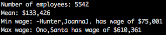

# UBC-wage-scraper
Scrapes the remunerations of UBC employees from the pdf accessible https://finance.ubc.ca/budgeting-reporting/financial-reports

version 1.0
- Scrapes data from a predefined path, and has no detection of what pages contain useful information (wages for employees)
- Prints out the mean, max and min wages and the employee names

This is written with python3.8
run via:
> python3 cleaner.py

